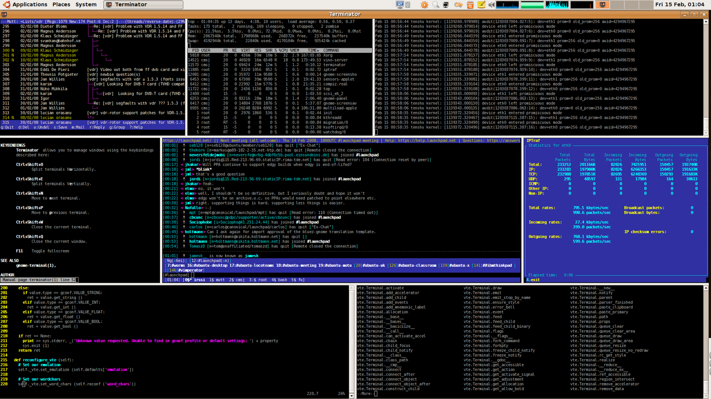

# Useful Linux Desktop Tools

## Terminator

As a software developer, I have almost always multiple terminal sessions open. If you are like me you will love Terminator: it will manage multiple terminal session in a single window for you. You can split the window horizontal or vertical and go on splitting the parts again and again as far as you like. Hide the window, unhide it - everything is still  aligned as before. No more fiddling around to align (tons of) terminal windows by yourself ...

### Most useful key bindings

  * Alt + Up/Down/Left/Right == switch to terminal
  * F11 == toogle fullscreen (Yeeehaa!)

### Screenshot

Well, that's madness, of course (taken from the terminator website).

[Homepage of Terminator](http://gnometerminator.blogspot.co.at/p/introduction.html)

